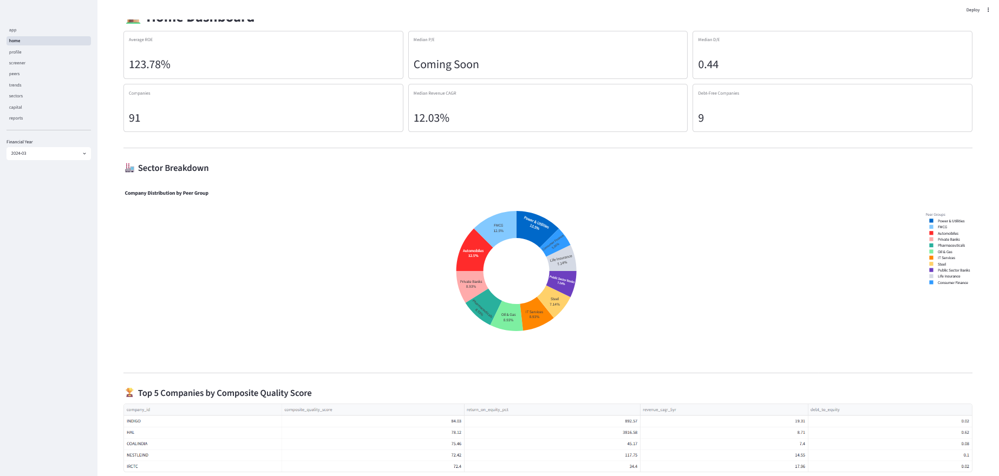
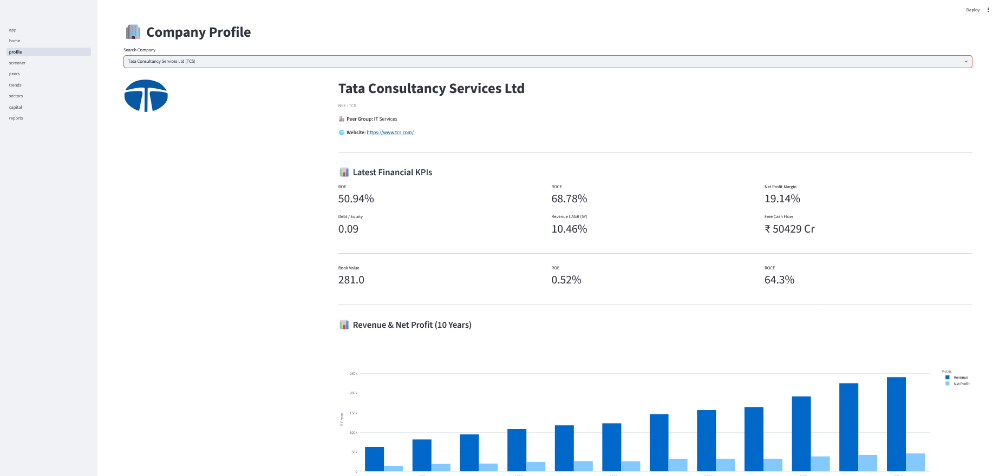
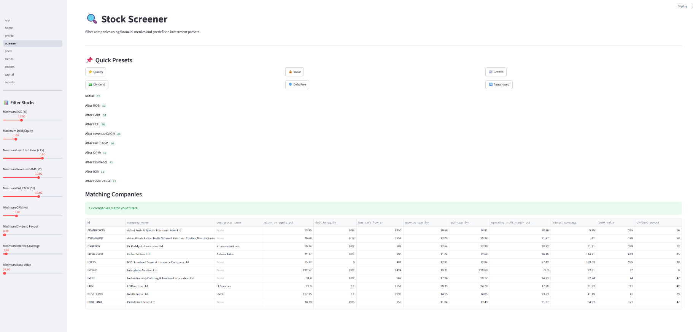
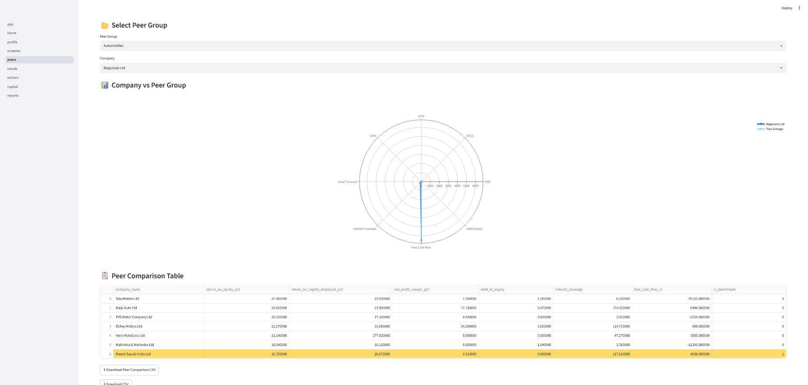
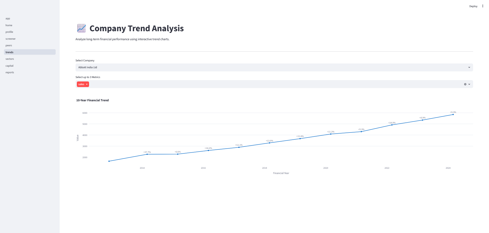
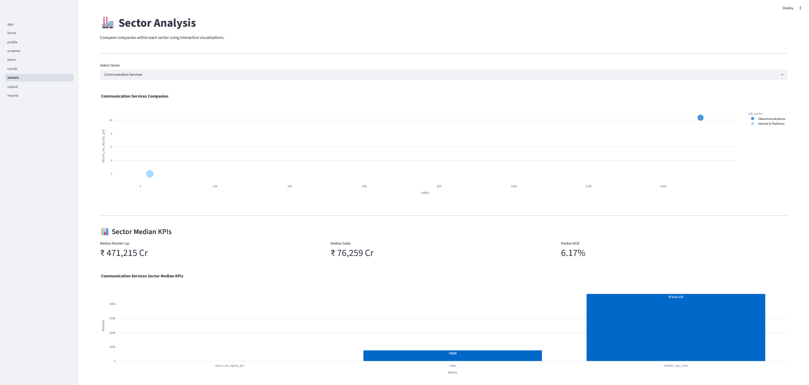
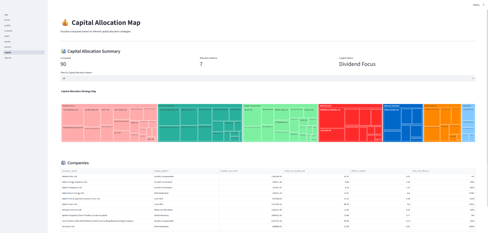
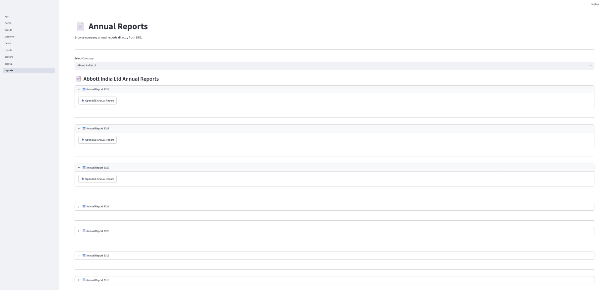

# 📈 NIFTY 100 Financial Intelligence Platform

An end-to-end Financial Intelligence Platform built using **Python, Streamlit, SQLite, Pandas, Plotly, and OpenPyXL** for analyzing NIFTY 100 companies.

## ✨ Features

- Automated ETL Pipeline
- Historical Financial Statement Analysis
- Financial Ratio Engine
- CAGR & Growth Analytics
- Capital Allocation Analysis
- Market Valuation Module
- Interactive Streamlit Dashboard
- Stock Screener with Presets
- Peer Group Comparison
- Sector Analysis
- Annual Reports Browser
- Company PDF Tearsheet Generation
- FastAPI REST APIs
- Automated Testing using Pytest

## 🚀 Project Overview

This project automates the complete financial analytics workflow for NIFTY 100 companies:
- Automated ETL pipeline
- SQLite database
- Financial ratio engine
- CAGR engine
- Cash flow KPI engine
- Stock screener
- Peer comparison
- Trend analysis
- Sector analysis
- Capital allocation map
- Annual reports browser
- Valuation module
- Excel & CSV report generation


## 🛠 Tech Stack

- Python
- Streamlit
- SQLite
- Pandas
- NumPy
- Plotly
- OpenPyXL
- Pytest
- Git & GitHub


## 📂 Project Structure

```text
NIFTY-100-Financial-Intelligence-Platform/
├── data/
├── database/
├── output/
├── reports/
├── src/
│   ├── analytics/
│   ├── api/
│   ├── dashboard/
│   ├── database/
│   ├── etl/
│   ├── screener/
│   └── validators/
├── tests/
├── requirements.txt
├── README.md
└── .gitignore
```

## 📊 Dashboard Modules

1. Home Dashboard
2. Company Profile
3. Stock Screener
4. Peer Comparison
5. Trend Analysis
6. Sector Analysis
7. Capital Allocation
8. Annual Reports
9. PDF Tearsheet
10. REST API (FastAPI)


## Sprint 1 – ETL & Database

- Automated Excel Loader
- Data Cleaning
- Data Validation
- Audit Logging
- SQLite Database
- Duplicate Detection
- Foreign Key Validation

Outputs:
- load_audit.csv
- validation_failures.csv

## Sprint 2 – Financial Analytics

Implemented:
- ROE, ROCE, ROA
- Net Profit Margin
- Operating Profit Margin
- Debt to Equity
- Interest Coverage
- Asset Turnover
- Free Cash Flow
- CFO Quality Score
- Revenue CAGR
- PAT CAGR
- EPS CAGR
- Capital Allocation
- Edge Case Logging
- Financial Screening

34 automated tests passed.


## Sprint 3 – Dashboard

Implemented:
- Home
- Company Profile
- Stock Screener
- Peer Comparison


## Sprint 4 – Advanced Analytics

Implemented:
- Trend Analysis
- Sector Analysis
- Capital Allocation Treemap
- Annual Reports Browser
- Valuation Module
- Report Exports


## Generated Outputs

- valuation_summary.xlsx
- valuation_flags.csv
- screener_output.xlsx
- peer_comparison.xlsx
- capital_allocation.csv
- growth_accelerator.xlsx
- quality_compounder.xlsx
- value_pick.xlsx
- turnaround_watch.xlsx
- debt_free_bluechip.xlsx
- dividend_champion.xlsx
- ratio_edge_cases.log


## Installation

```bash
git clone <repository-url>

cd NIFTY-100-Financial-Intelligence-Platform

pip install -r requirements.txt

streamlit run src/dashboard/app.py
```
## Running the API

```bash
uvicorn src.api.main:app --reload
```

Swagger UI

```
http://127.0.0.1:8000/docs
```

OpenAPI

```
http://127.0.0.1:8000/openapi.json
```

---

## Running Tests

Run all tests

```bash
pytest
```

Generate HTML Report

```bash
pytest --html=reports/pytest_report.html --self-contained-html
```

# 📷 Dashboard Screens

## 🏠 Home Dashboard

Interactive overview of the NIFTY 100 financial dataset.



## 📈 Company Profile

Search companies and analyze financial performance.



## 🔍 Stock Screener

Screen companies using financial filters and investment presets.



## 📊 Peer Comparison

Compare companies with peers using radar charts and KPIs.



## 📉 Trend Analysis

Analyze 10-year financial trends with interactive charts.



## 🏭 Sector Analysis

Visualize sector performance using bubble charts and KPI summaries.



## 🧩 Capital Allocation Map

Interactive treemap of capital allocation strategies.



## 📄 Annual Reports

Access company annual reports directly from BSE.



## Sprint 5 – Reporting & NLP & Financial Reporting & Intelligence

### Features

- Automated NLP parsing
- Pros & Cons generation
- Cash Flow Intelligence Engine
- Capital Allocation Analysis
- Pattern Change Detection
- Company Tearsheet PDFs
- Batch Report Generation
- Sector Summary Reports
- Portfolio Summary Report

## Sprint 6 – API Development, Testing & Performance

### Implemented

#### FastAPI Backend

- REST API architecture
- Health monitoring endpoint
- Company Profile APIs
- Profit & Loss APIs
- Balance Sheet APIs
- Cash Flow APIs
- Financial Ratio APIs
- Stock Screener APIs
- Sector Analysis APIs
- Peer Group APIs
- Market Capitalization APIs
- Annual Reports APIs
- PDF Tearsheet Download APIs

#### API Features

- Swagger UI Documentation
- OpenAPI Specification
- Query Parameter Filtering
- Search Functionality
- Error Handling
- JSON Response Validation

#### Testing

- Unit Testing
- API Endpoint Testing
- Integration Testing
- Concurrent Load Testing
- Dashboard Performance Testing
- HTML Test Report Generation
- End-to-End Validation

#### Performance Optimization

- SQLite Query Optimization
- Database Index Creation
- Concurrent API Request Handling
- Dashboard Response Time Benchmarking
- API Health Monitoring

#### Documentation

- Analyst Guide
- Developer Guide
- API Reference
- User Manual
- Updated README

### Outputs

- pytest_report.html
- performance_report.md
- analyst_guide.pdf
- developer_guide.md
- api_reference.md
- user_manual.md
- OpenAPI Documentation
- Swagger Documentation

## REST API Endpoints

| Endpoint | Description |
|-----------|-------------|
| /health | API Health |
| /companies | Company List |
| /companies/{ticker} | Company Profile |
| /companies/{ticker}/pl | Profit & Loss |
| /companies/{ticker}/bs | Balance Sheet |
| /companies/{ticker}/cashflow | Cash Flow |
| /companies/{ticker}/ratios | Financial Ratios |
| /screener | Stock Screener |
| /sectors | Sector Summary |

## Testing Summary

- Unit Testing using Pytest
- API Testing
- Integration Testing
- Concurrent Load Testing
- Dashboard Performance Testing
- HTML Test Reports

## Performance

- SQLite query optimization using indexes
- Concurrent API load testing completed
- Dashboard response time within target
- End-to-end integration verified

### Outputs

- analysis_parsed.csv
- pros_cons_generated.csv
- cashflow_intelligence.csv
- pattern_changes.csv
- report_generation_errors.csv
- Company PDF Reports
- Sector Reports
- Portfolio Summary PDF

## Future Enhancements

- Live NSE APIs
- Portfolio Tracker
- AI Investment Advisor
- Forecasting
- News Sentiment

## 📅 Sprint Summary

| Sprint | Focus | Status |
|---------|-------|--------|
| Sprint 1 | ETL & Database | ✅ Completed |
| Sprint 2 | Financial Analytics | ✅ Completed |
| Sprint 3 | Dashboard Development | ✅ Completed |
| Sprint 4 | Advanced Analytics | ✅ Completed |
| Sprint 5 | Reporting & Intelligence | ✅ Completed |
| Sprint 6 | FastAPI, Testing & Documentation | ✅ Completed |

## Author

**Likitha R**

B.Tech – Computer Science & Engineering

University Visvesvaraya College of Engineering

Data Analytics Intern | Bluestock Fintech
